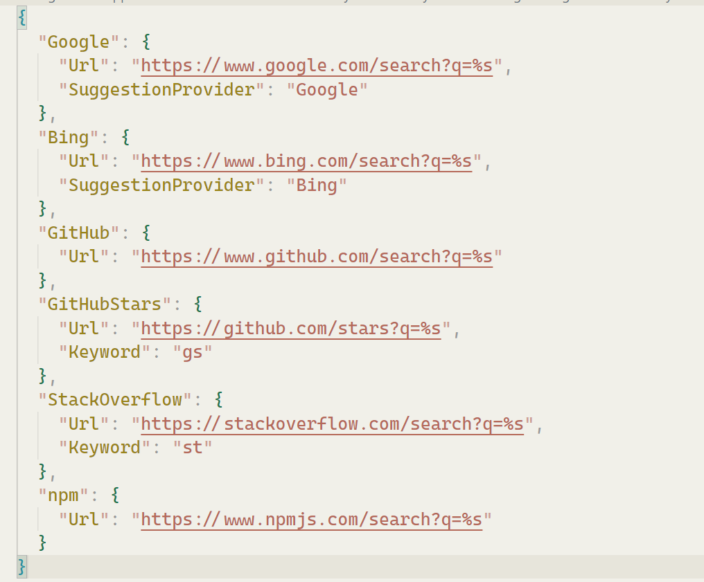

# PowerToys-Run-WebSearchShortcut

This is a simple [PowerToys Run](https://docs.microsoft.com/en-us/windows/powertoys/run) plugin for quickly select a specific search engine to perform searches.

## Preview

> If you have configured the 'Keyword' field, you can use the abbreviation keyword to specify the search engine.

## Requirements

- PowerToys minimum version 0.79.0

## Installation

- Download the [latest release](https://github.com/Daydreamer-riri/PowerToys-Run-WebSearchShortcut/releases/) by selecting the architecture that matches your machine: `x64` (more common) or `ARM64`
- Close PowerToys
- Extract the archive to `%LOCALAPPDATA%\Microsoft\PowerToys\PowerToys Run\Plugins`
- Open PowerToys

## Config

- Open config file:

- Inside the config file, you can add your desired search engines. The key is the display name of the search engine, and the `url` property is the URL template for performing the search. Use `%s` as a placeholder for the search query.

- Run `reload`:

## Roadmap

- [x] Keyword field
- [ ] Search suggestions 

## License

[MIT](./LICENSE) License © 2023 [Riri](https://github.com/Daydreamer-riri)
