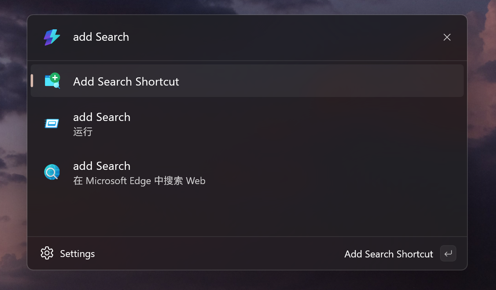
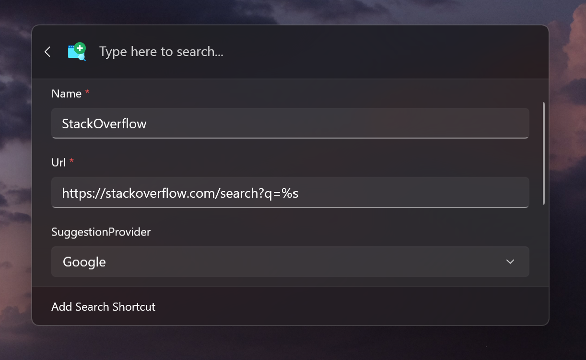

# PowerToys-Run-WebSearchShortcut

[](https://github.com/hlaueriksson/awesome-powertoys-run-plugins)

[](https://apps.microsoft.com/detail/9p9hchbgbrf4)

This is a simple [PowerToys CmdPal](https://learn.microsoft.com/en-us/windows/powertoys/command-palette/overview) plugin for quickly selecting a specific search engine to perform searches via keyword prefixes.

> If you are looking for the Powertoys Run plugin, please check: [WebSearchShortcut run plugin](./README-Run.md)

## Preview


## Installation

### MSStore

Click the badge below to go to the store page:

[](https://apps.microsoft.com/detail/9p9hchbgbrf4)

### WinGet

Coming soon.

### MSIX Files

You can download the MSIX files from the [Releases](https://github.com/Daydreamer-riri/PowerToys-Run-WebSearchShortcut/releases) page on GitHub. Choose the appropriate file for your architecture (**x64**(more common) or **ARM**) and install it manually.

## Configuration

- Access the command shown in the image:



- Complete the form's content and save it.

## Configuration fields

### `Url`

The URL template for performing the search. Use `%s` as a placeholder for the search query. If the URL does not contain `%s`, the URL will be opened directly when you press enter.

```json
{
  "Google": {
    "Url": "https://www.google.com/search?q=%s"
  }
}
```

> More example: https://github.com/Daydreamer-riri/PowerToys-Run-WebSearchShortcut/blob/main/README-Run.md#example

### `ReplaceWhitespace`

With `ReplaceWhitespace`, you can specify which character(s) to replace a space with when performing a search. This is useful for some websites, such as Wikipedia, which don't use plus signs ("+") to separate words in the URL.

| Value         | Result             |
|---------------|--------------------|
| `" "` or `""` | `Example+search`   |
| `"-"`         | `Example-search`   |
| `"_"`         | `Example_search`   |
| `"+"`         | `Example%2Bsearch` |

> **Note**: As the string is converted to a URL, any spaces in the string (or `ReplaceWhitespace`) will be replaced with plus signs. Any other characters that are not allowed in a URL will be encoded with [percent-encoding](https://en.wikipedia.org/wiki/Percent-encoding).

### `SuggestionProvider`

Used to set the search suggestion provider.

**The currently supported search suggestion providers are:**

- `Google`
- `Bing`
- `npm`
- `CanIUse`

Planned:

- [ ] `DuckDuckGo`
- [ ] `Yandex`
- [ ] `Baidu`
- [x] `Youtube`
- [ ] `Wiki`

PRs welcome!

> You can also set a Provider to another search engine.
> For example:
>
> 

## Credits

- This project can only be completed under the guidance of [this article](https://conductofcode.io/post/creating-custom-powertoys-run-plugins/). Thanks to @hlaueriksson for his great work.

- The search suggestion feature of this project is based on the relevant implementation of [FlowLauncher](https://github.com/Flow-Launcher/Flow.Launcher?tab=readme-ov-file#web-searches--urls), thanks @Flow-Launcher!

## Thanks

Thank you to [@thatgaypigeon](https://github.com/thatgaypigeon) for writing the excellent documentation!

## License

[MIT](./LICENSE) License © 2023 [Riri](https://github.com/Daydreamer-riri)
