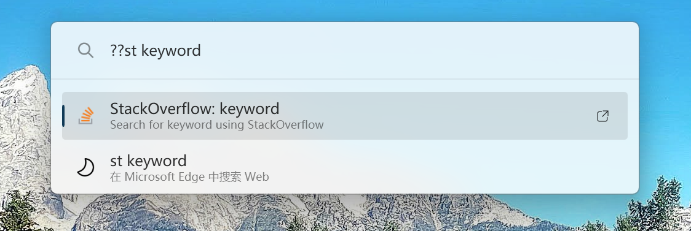
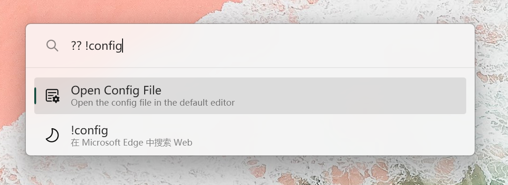
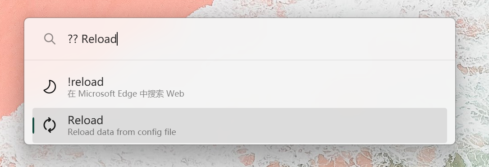

# PowerToys-Run-WebSearchShortcut

This is a simple [PowerToys Run](https://docs.microsoft.com/en-us/windows/powertoys/run) plugin for quickly select a specific search engine to perform searches.

## Preview



> If you have configured the 'Keyword' field, you can use the abbreviation keyword to specify the search engine.

## Requirements

- PowerToys minimum version 0.79.0

## Configuration field

### Url

The URL template for performing the search. Use `%s` as a placeholder for the search query.

### Keyword

Used to quickly select the target search engine.

### SuggestionProvider

Used to set the search suggestion.

Currently only `Google` and `Bing`'s suggestion apis are supported.

> You can also set a Provider to another search engine.
> eg:
> ```json
> {
>   "StackOverflow": {
>     "Url": "https://stackoverflow.com/search?q=%s",
>     "SuggestionProvider": "Google"
>   }
> }
> ```

## Installation

- Download the [latest release](https://github.com/Daydreamer-riri/PowerToys-Run-WebSearchShortcut/releases/) by selecting the architecture that matches your machine: `x64` (more common) or `ARM64`
- Close PowerToys
- Extract the archive to `%LOCALAPPDATA%\Microsoft\PowerToys\PowerToys Run\Plugins`
- Open PowerToys

## Config

- Open config file:



- Inside the config file, you can add your desired search engines. The key is the display name of the search engine, and the `url` property is the URL template for performing the search.
eg:
```json
{
  "Google": {
    "Url": "https://www.google.com/search?q=%s",
    "SuggestionProvider": "Google"
  },
  "Bing": {
    "Url": "https://www.bing.com/search?q=%s",
    "SuggestionProvider": "Bing"
  },
  "GitHub": {
    "Url": "https://www.github.com/search?q=%s"
  },
  "GitHubStars": {
    "Url": "https://github.com/stars?q=%s",
    "Keyword": "gs"
  },
  "StackOverflow": {
    "Url": "https://stackoverflow.com/search?q=%s",
    "Keyword": "st"
  },
  "npm": {
    "Url": "https://www.npmjs.com/search?q=%s"
  }
}
```

- Run `reload`:



## Roadmap

- [x] Keyword field
- [x] Search suggestions 

## License

[MIT](./LICENSE) License © 2023 [Riri](https://github.com/Daydreamer-riri)
